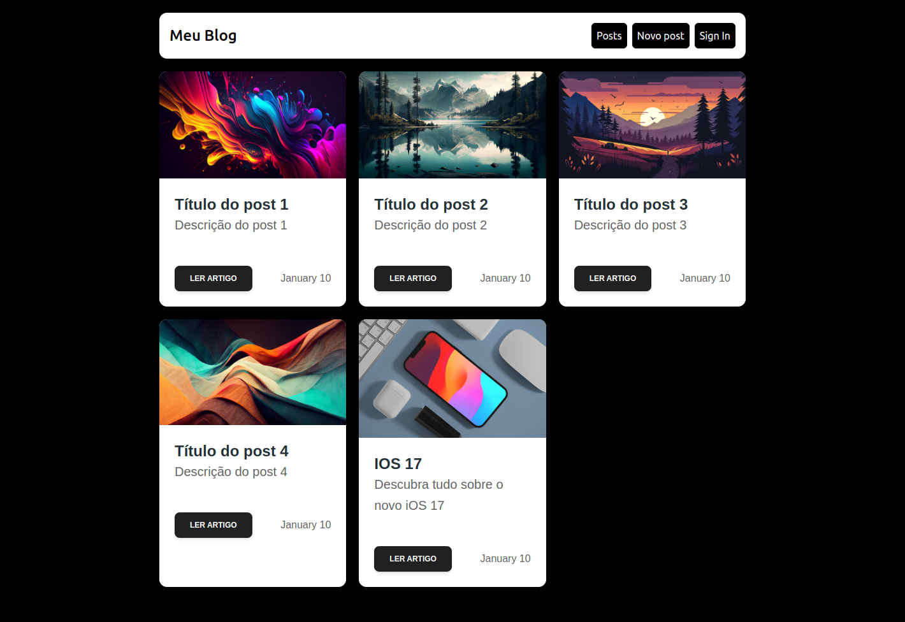
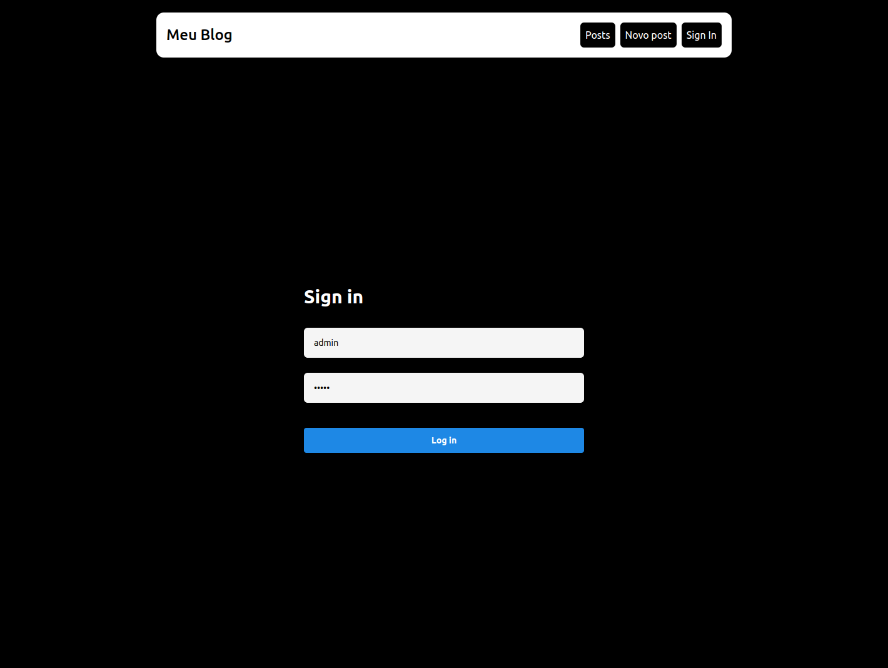
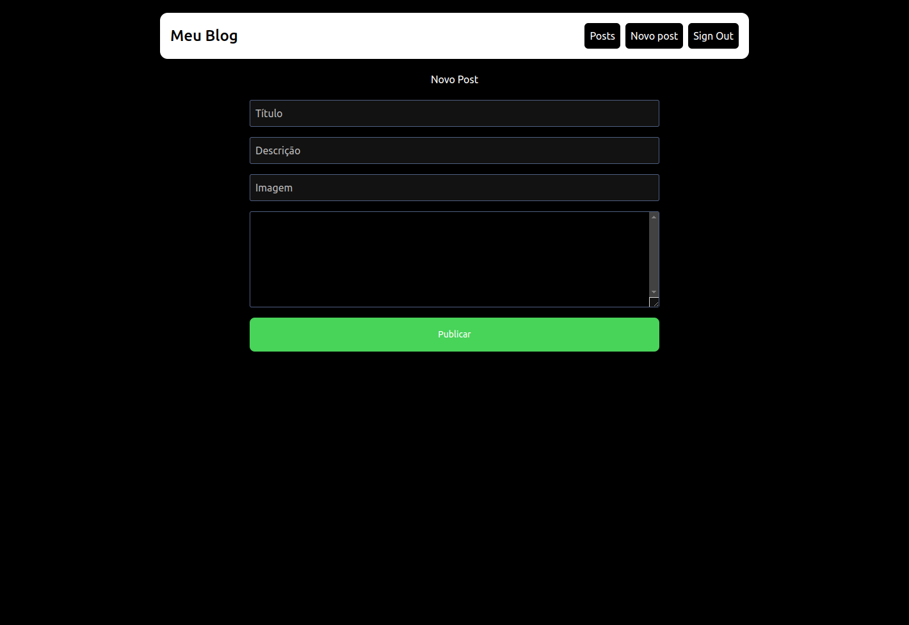

# Blog com Página de Login

Este projeto é um exemplo de um blog desenvolvido utilizando Next.js, com uma funcionalidade de login de usuário. O objetivo deste projeto é demonstrar como criar uma aplicação web moderna com autenticação de usuários, utilizando as melhores práticas e recursos avançados do Next.js.

## Funcionalidades

- **Autenticação de Usuário**: Sistema de login seguro que concede apenas ao administrador a permissão de adicionar posts.
- **Gerenciamento de Sessão**: Utilização de cookies e tokens para gerenciar sessões de usuário de forma segura.
- **CRUD de Posts**: Interface para criação, leitura, atualização e exclusão de posts no blog.
- **Roteamento Dinâmico**: Utilização do roteamento dinâmico do Next.js para gerar páginas de posts individuais.
- **Desempenho Otimizado**: Recursos do Next.js para otimização de desempenho, incluindo geração estática e renderização no lado do servidor.

## Tecnologias Utilizadas

- **Next.js**: Framework React para renderização híbrida e roteamento avançado.
- **React**: Biblioteca JavaScript para construção de interfaces de usuário.
- **Tailwind CSS**: Framework de utilitários CSS para estilização rápida e responsiva.

## Imagens


---



---



## Como Executar o Projeto

### Pré-requisitos

- Node.js (versão 14 ou superior)
- npm (gerenciador de pacotes do Node.js) ou yarn

### Passos para Execução

1. **Clonar o Repositório**:
    ```bash
    git clone git@github.com:MatheusSGomes/blog-nextjs.git
    cd blog-nextjs
    ```

2. **Instalar Dependências**:
    ```bash
    npm install
    # ou
    yarn install
    ```
2. **Iniciar o Servidor de Desenvolvimento**:
    ```bash
    npm run dev
    # ou
    yarn dev
    ```

6. **Acessar o Projeto**:
    Abra o navegador e acesse `http://localhost:3000`.

## Estrutura do Projeto

- `/pages`: Contém as páginas da aplicação, incluindo login e posts.
- `/ui/components`: Componentes reutilizáveis da interface.
- `/styles`: Arquivos de estilização.

## Contribuição

Contribuições são bem-vindas! Sinta-se à vontade para abrir issues e pull requests para melhorar o projeto.

## Licença

Este projeto está licenciado sob a Licença MIT. Veja o arquivo [LICENSE](LICENSE) para mais detalhes.
